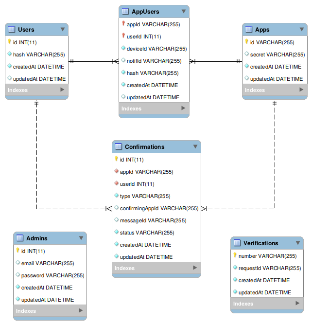

# HumanID API

HumanID API server. API doc and demo https://humanid.herokuapp.com

Demo credentials:
* Webconsole admin email/password: `admin@local.host` / `admin123`
* Mobile app ID/secret: `Demo App` / `2ee4300fd136ed6796a6a507de7c1f49aecd4a11663352fe54e54403c32bd6a0`

## Prerequisites

1. Node.js >= 10 LTS
2. RDBMS (MySQL >= 14.14 or SQLite3 >= 3.22)

## Setup

1. Install `nodejs >= 10.x.x`
2. Clone repo & install dependencies `npm i`
3. Run test `npm test`
4. Generate doc `npm run doc` (requires `apidoc` http://apidocjs.com/)
   
## Configuration

App configuration is read from `config.json`. You can reuse the provided example in `config.json.example`. 

**Database**

For `DATABASE` configuration please refer to [Sequelize configuration](http://docs.sequelizejs.com/manual/getting-started). Some common examples:

> Sqlite3 file storage

```
{
    ...
    "DATABASE": {
        "username": "root",
        "password": null,
        "database": "humanid",
        "dialect": "sqlite",
        "storage": "db.sqlite"
    },
    ...
}
```

> MySQL with connection pooling

```
{
    ...
    "DATABASE": {
        "username": "root",
        "password": "root",
        "database": "humanid",
        "dialect": "mysql",
        "pool": {
            "max": 5,
            "min": 0,
            "acquire": 30000,
            "idle": 10000
        }    
    },
    ...
}
```

**Twilio Authy**

To enable phone number verification SMS please provide valid Twilio Authy API URL and API Key. Example:

```
{
    ...
    "AUTHY_API_URL": "https://api.authy.com",
    "AUTHY_API_KEY": "MQLNW0xQMh4Hh6sxDDyIqLJilIjS2gNp",
}
```
> If either `AUTHY_API_URL` or `AUTHY_API_KEY` is missing, no verification SMS will be triggered and verification code is not validated (**always considered valid**)

## Class/Entity Relationship Diagram

The API server stores data in given structure:

> `SequelizeMeta` is just ORM migration metadata which is not related to business process


